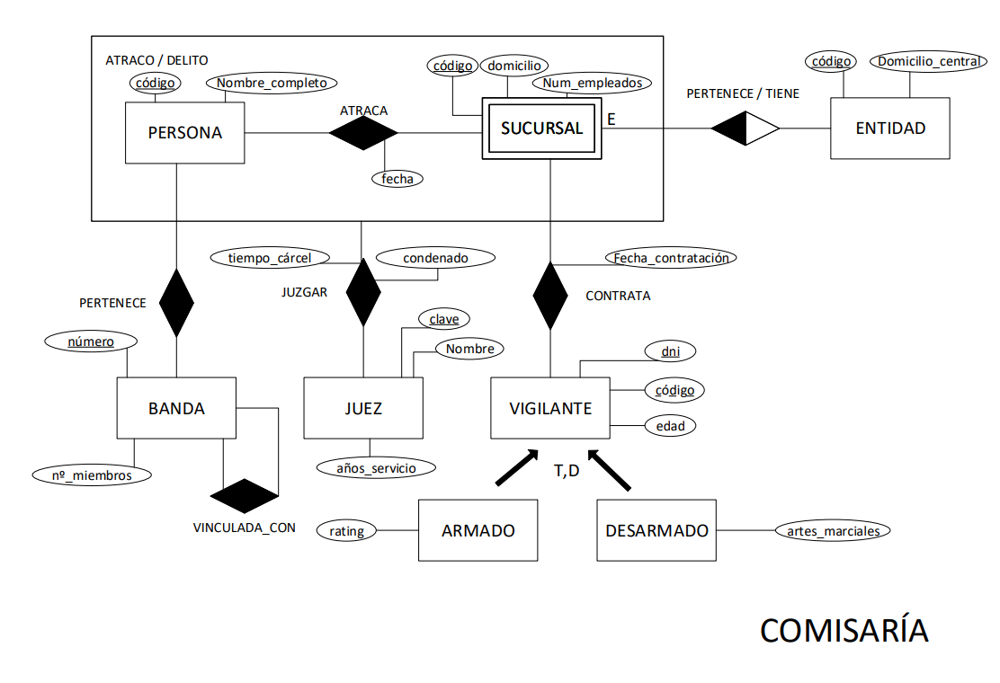
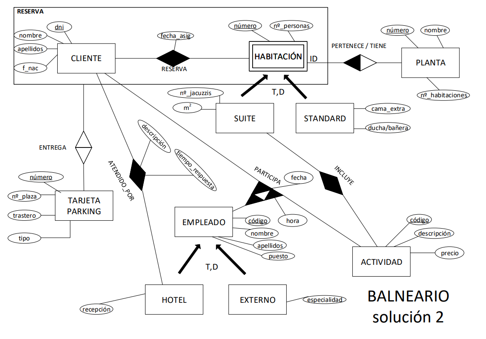

# EJERCICIO 1: COMISARÍA

La Policía quiere crear una base de datos sobre la seguridad en algunas entidades bancarias. Para ello tiene en cuenta:

- Que cada entidad bancaria se caracteriza por un código y por el domicilio de su Central. Cada entidad bancaria tiene más de una sucursal que también se caracteriza por un código y por el domicilio, así como por el número de empleados de dicha sucursal.
- Cada sucursal contrata, según el día, algunos vigilantes jurados, que se caracterizan por un código, el DNI y su edad. Un vigilante puede ser contratado por diferentes sucursales (incluso de diferentes entidades), en distintas fechas y es un dato de interés dicha fecha, así como si se ha contratado con arma o no. De los armados queremos conocer su rating de tiro y de los que no tienen arma si saben o no artes marciales.
- Por otra parte, se quiere controlar a las personas que han sido detenidas por atracar las sucursales de dichas entidades. Estas personas se definen por una clave (código) y su nombre completo. Alguna de estas personas están integradas en algunas bandas organizadas y por ello se desea saber a qué banda pertenecen, sin ser de interés si la banda ha participado en el delito o no. Dichas bandas se definen por un número de banda y por el número de miembros, en ocasiones estas bandas tienen vínculos con otras bandas peligrosas como yihadistas o de cárteles de la droga.
- Así mismo, es interesante saber en qué fecha ha atracado cada persona una sucursal. Evidentemente, una persona puede atracar varias sucursales en diferentes fechas, así como que una sucursal puede ser atracada por varias personas.
- Igualmente, se quiere saber de estos atracos qué Juez ha estado encargado del caso, sabiendo que un individuo, por diferentes delitos, puede ser juzgado por diferentes jueces. Es de interés saber, en cada delito, si la persona detenida ha sido condenada o no y de haberlo sido, cuánto tiempo pasará en la cárcel. Un Juez se caracteriza por una clave interna del juzgado, su nombre y los años de servicio.

**NOTA**: En ningún caso interesa saber si un vigilante ha participado en la detención de un atracador.

# EJERCICIO 2: BALNEARIO

En un hotel-balneario se desea informatizar parte de la gestión relativa a clientes. Tras el análisis realizado, se establecen los siguientes requerimientos:

- Los datos de interés que se desea almacenar del cliente son: DNI, nombre, apellidos y fecha de nacimiento.
- Un cliente reservará una habitación determinada de una planta del hotel, pudiendo estar a lo largo del tiempo otras veces en el hotel, en diferentes habitaciones y plantas, siendo significativa la fecha de asignación de la habitación y el número de ésta. Habrá que tener en cuenta que las habitaciones se numeran correlativamente por cada planta, es decir, existirá la habitación número 1 de la tercera planta y también la número 1 de la octava planta. Las plantas del hotel estarán identificadas por número de planta, su nombre y número de habitaciones de que dispone. En cada habitación deberemos almacenar el número de personas que caben y cada una puede clasificarse en **SUITE** o **STANDARD**. De la **SUITE** tendrá incluidas gratuitamente una serie de actividades que deberemos almacenar en la base de datos, y como campos el número de jacuzzis que tiene y los m² de espacio que ocupa la habitación. Si es **STANDARD** solo guardaremos si tiene derecho a una cama extra o no y si tiene ducha o bañera.
- Por cada reserva se puede entregar o no hasta un máximo de 1 tarjeta para poder ocupar el **PARKING** del hotel (si esta se pide o no). Estas tarjetas serán válidas para un único cliente y habitación. La tarjeta se definirá por: número de tarjeta, número de plaza de garaje y si tiene o no trastero. También habrá dos tipos de tarjeta: **PREMIUM** y **NORMAL**. Como se mencionó, para la habitación y cliente puede que no se desee tarjeta alguna.
- Un cliente puede realizar llamadas a recepción, el hotel quiere controlar estas llamadas para evaluar la eficacia de sus empleados. Será resuelta por un empleado de recepción, queriendo conocer el tiempo de respuesta y la descripción de lo que necesitaba. A su vez, el cliente puede realizar diferentes actividades que requieran de la participación de empleados especializados (excursiones guiadas del hotel, masajes, usar el SPA, regalos, clases de piscina…). A un cliente le deben atender diferentes empleados del hotel o empleados que trabajan para el hotel externamente, contratados para estas actividades especiales. Un empleado del hotel o externo puede atender diferentes tipos de actividades y viceversa, siendo significativa por cada actividad que se realice sobre el cliente la fecha y hora de ésta.
- Los datos de interés de los empleados del hotel o externos serán: código del empleado, nombre y apellidos y puesto. Los datos de interés de las actividades serán: código de actividad, descripción y precio. Deberemos poder distinguir si es un empleado del hotel, de recepción o no y si es externo o no. (Este es el ejercicio avanzado)

