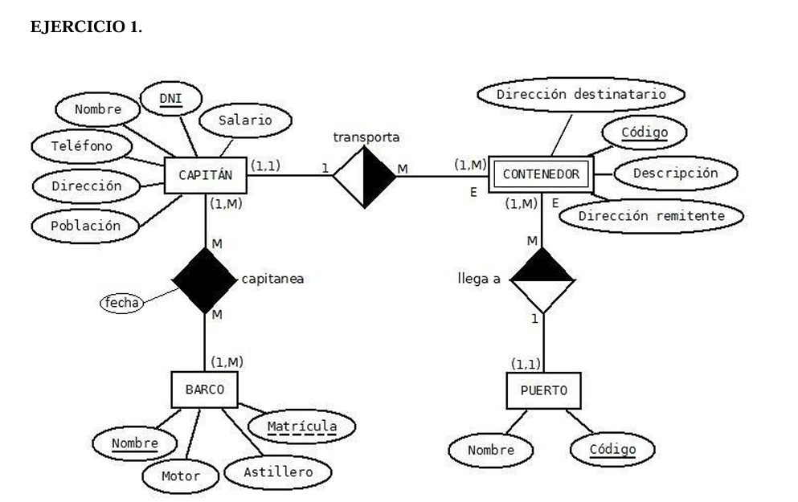
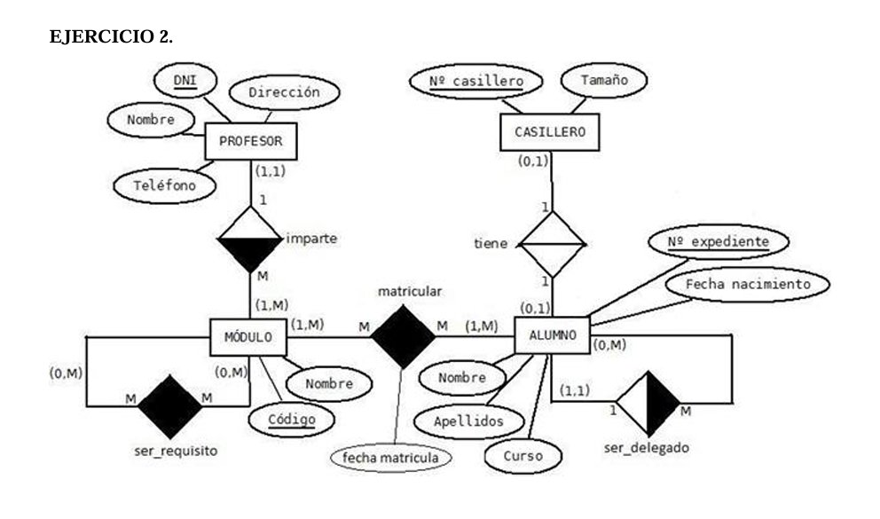
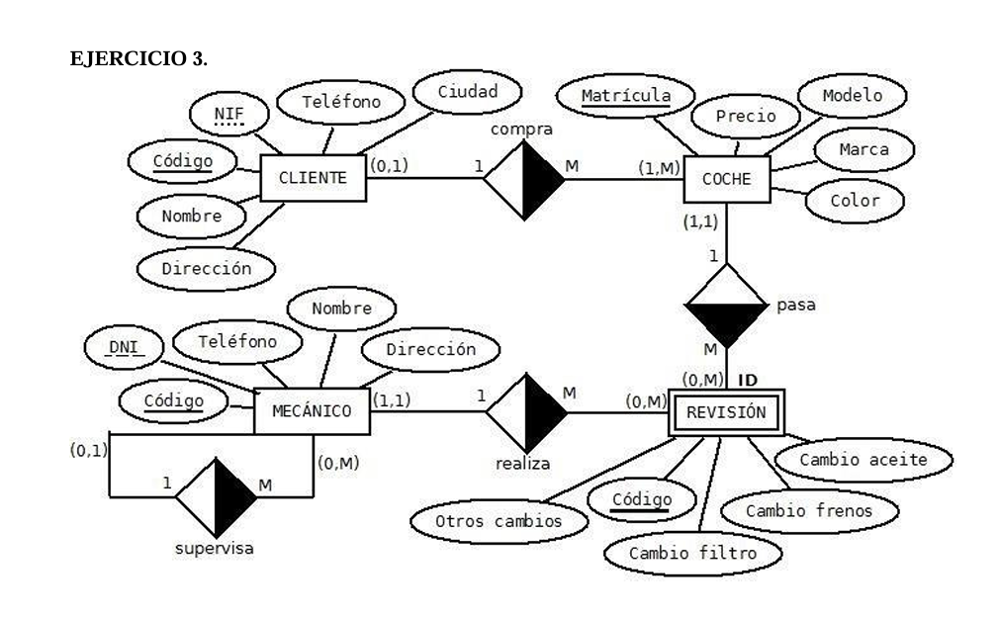
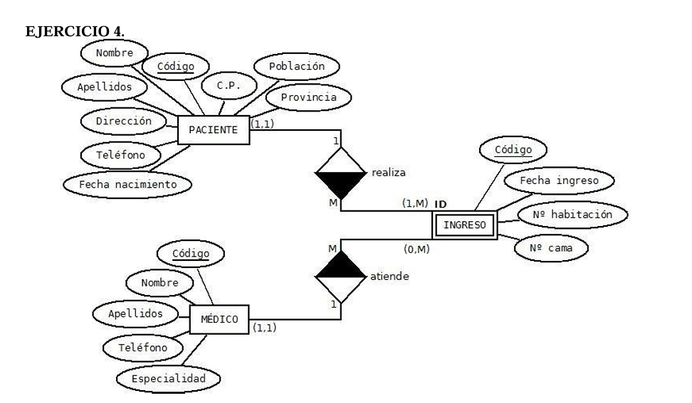
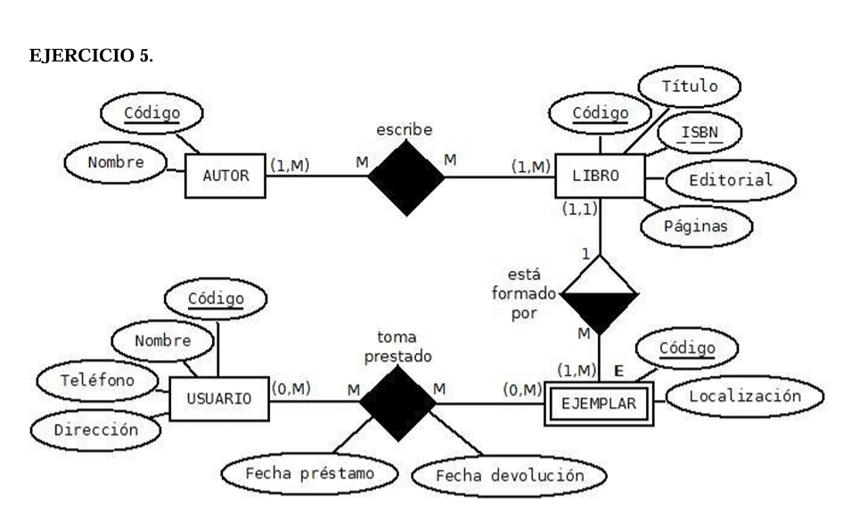

# CAPITAN( dni, nombre, teléfono, dirección, población, salario) PK: DNI BARCO (nombre, matricula, motor, astillero) PK: nombre UK: matricula CAPITANEA (nombre_barco, dni_ capitan, fecha) PK: (nombre_barco, dni_capitan) FK: nombre_barco → BARCO FK: dni_capitan → CAPITAN PUERTO ( código, nombre) PK: código CONTENEDOR (código, descripción, remitente, destinatario, dni_capitán, código_puerto) PK:código VNN:dni_capitan VNN:código_puerto FK: dni_capitan→ CAPITAN FK: código_puerto → PUERTO 

# PROFESOR (dni, nombre, dirección, teléfono) PK: dni MODULO ( código, nombre, dni_profesor) PK: código FK: dni_profesor → PROFESOR SER_REQUISITO (código_mod1, código_mod2) PK: ( código_mod1, código_mod2) FK: código_mod1→ MODULO FK: código_mod2→ MODULO ALUMNO (n.º_expediente, nombre, apellidos, curso, fecha_nacimiento, exp_delegado) PK: nº_expediente FK: exp_delegado → ALUMNO MATRICULAR ( expediente_alumno, código_módulo, fecha_matricula) PK: (expediente_alumno, código_módulo) FK: expediente_alumno → ALUMNO FK: código_módulo → MODULO CASILLERO (número, tamaño) PK: número TIENE (expediente_alumno, número_casillero) PK: expediente_alumno UK: número_casillero FK: expediente_alumno → ALUMNO FK: número_casillero → CASILLERO 

# CLIENTE ( código, nif, nombre, dirección, teléfono, ciudad) PK: código UK: nif COCHE (matrícula, precio, modelo, marca, color, código_cliente) PK: matrícula FK: código_cliente → CLIENTE MECANICO ( código, dni, teléfono, nombre, dirección, supervisor) PK: código UK: dni FK: supervisor → MECANICO REVISION ( código, cambio_filtro, cambio_frenos, cambio_aceite, otros_cambios, matricula_coche, código_mecánico) PK (código, matricula_coche) FK: matricula_coche → COCHE FK: código_mecánico → MECANICO 

# PACIENTE ( código, nombre, apellidos, dirección, teléfono, fecha_nacimiento, C.P, población, provincia) PK: código MEDICO (código, nombre, apellidos, teléfono, especialidad) PK: código INGRESO (código, fecha_ingreso, nº_habitación, nº_cama, código_paciente, código_médico) PK: (código, código_paciente) FK: código_paciente → PACIENTE FK: código_médico → MEDICO

# AUTOR (código, nombre) PK: código LIBRO (código, isbn, título, editorial, páginas) PK: código UK: isbn ESCRIBE ( código_autor, código_libro) PK (código_autor, código_libro) FK: código_autor → AUTOR FK: código_libro → LIBRO USUARIO (código, nombre, teléfono, dirección) PK: código EJEMPLAR (código, localización, código_libro) PK: código VNN: código_libro FK: código_libro → LIBRO TOMA_PRESTADO (código_usuario, código_ejemplar, fecha_préstamo, fecha_devolución) PK: (código_usuario, código_ejemplar) FK: codigo_usuario → USUARIO FK: código_ejemplar → EJEMPLAR 