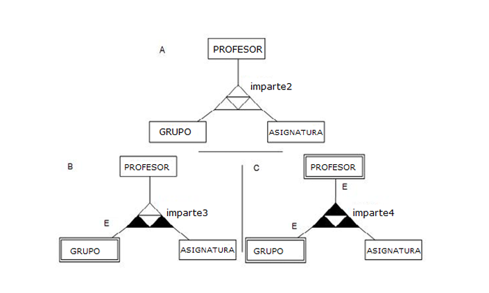

# Relaciones Ternarias en Diagramas Entidad-Relación

## incompleto

# Casos de Conectividad en Relaciones Ternarias

## Caso A: Conectividad 1:1:1

En este caso, la conectividad es **1:1:1**, es decir, para cada posible pareja de ocurrencias de entidad, solo una de la entidad restante se asocia con ella. Dicho de otro modo, una ocurrencia de `grupo-asignatura` (por ejemplo, `<2A, FBD>`) solo puede aparecer una vez, como mucho, dentro de la relación `imparte2`.

**Cardinalidades:**

| Cardinalidad                                         | Valor  |
|------------------------------------------------------|--------|
| \((\text{PROFESOR, ASIGNATURA}), \text{IMPARTE}\)    | (0, 1) |
| \((\text{PROFESOR, GRUPO}), \text{IMPARTE}\)         | (0, 1) |
| \((\text{ASIGNATURA, GRUPO}), \text{IMPARTE}\)       | (0, 1) |
| \(\text{PROFESOR, IMPARTE}\)                         | (0, n) |
| \(\text{ASIGNATURA, IMPARTE}\)                       | (0, n) |
| \(\text{GRUPO, IMPARTE}\)                            | (0, n) |

---

## Caso B: Conectividad 1:N:N

La conectividad **1:N:N** nos indica que, para un profesor que da clase a un determinado grupo, este puede impartir varias asignaturas, y que cada profesor que imparte una asignatura concreta lo hace en varios grupos. Sin embargo, un único profesor imparte una asignatura específica en un grupo determinado.

Por ejemplo, supongamos la siguiente ocurrencia de `imparte3` utilizando tan solo los identificadores de cada entidad.

Además, la entidad `Grupo` tiene una **restricción de existencia** respecto de `imparte3`, lo cual obliga a que cada ocurrencia de grupo aparezca al menos una vez en la relación ternaria. Sin embargo, no se ofrece ningún mecanismo de representación en el modelo EER para fijar la cardinalidad mínima de una pareja en 1 frente a la relación ternaria; es decir, no se puede obligar a que cada posible pareja de ocurrencias de dos entidades aparezca en la relación ternaria.

**Cardinalidades:**

| Cardinalidad                                         | Valor  |
|------------------------------------------------------|--------|
| \((\text{PROFESOR, ASIGNATURA}), \text{IMPARTE}\)    | (0, n) |
| \((\text{PROFESOR, GRUPO}), \text{IMPARTE}\)         | (0, n) |
| \((\text{ASIGNATURA, GRUPO}), \text{IMPARTE}\)       | (0, 1) |
| \(\text{PROFESOR, IMPARTE}\)                         | (0, n) |
| \(\text{ASIGNATURA, IMPARTE}\)                       | (0, n) |
| \(\text{GRUPO, IMPARTE}\)                            | (1, n) |

---

## Caso C: Conectividad N:N:N

En este caso, la relación es **N:N:N**, lo que significa que se puede dar cualquier combinación de ocurrencias de entidad. Además, tanto la entidad `Grupo` como la entidad `Profesor` tienen una **restricción de existencia** respecto de `imparte4`.

**Cardinalidades:**

| Cardinalidad                                         | Valor  |
|------------------------------------------------------|--------|
| \(({PROFESOR, ASIGNATURA}), \text{IMPARTE})          | (0, n) |
| \((\text{PROFESOR, GRUPO}), \text{IMPARTE})          | (0, n) |
| \((\text{ASIGNATURA, GRUPO}), \text{IMPARTE})        | (0, n) |
| \(\text{PROFESOR, IMPARTE})                          | (1, n) |
| \(\text{ASIGNATURA, IMPARTE})                        | (0, n) |
| \(text{GRUPO, IMPARTE})                              | (1, n) |
 

