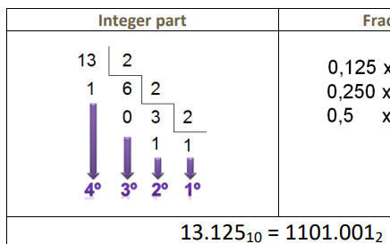

# Resumen de conversiones de redes U5

## Decimal a Binario

en esta imagen vemos el paso de decimal a binario

<!--Ejemplo-->
## Binario a Decimal

en esta imagen vemos el paso de binario a decimal

## binario a hexadecimal

en esta imagen vemos el paso de binario a hexadecimal

## hexadecimal a binario

en esta imagen vemos el paso de hexadecimal a binario

## decimal a hexadecimal

en esta imagen vemos el paso de decimal a hexadecimal

## hexadecimal a decimal

en esta imagen vemos el paso de hexadecimal a decimal